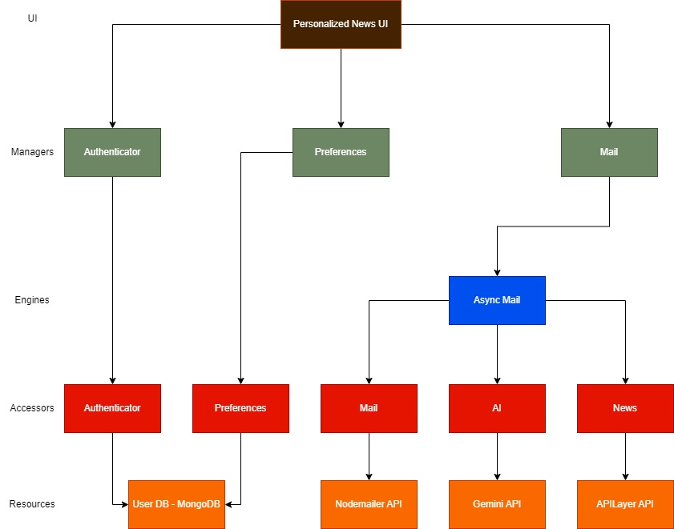

# Personalized News Aggregator with AI

## System Diagram


## Technologies Used
- **Backend**: Node.js, Express.js, Dapr, Docker.

- **Frontend**: React.js.

- **Database**: MongoDB.

- **APIs**: Gemini API for summarized news, APILayer for news.

- **More**: Postman, Integration tests.

## Running the Project
### Prerequisites
- Docker and Docker Compose

- Node.js and npm

### Steps to Run

1. Clone the repository
```Bash []
git clone https://github.com/HaythamT95/PersonalizedNews.git
```

2. Start the Backend
```Bash []
docker-compose up --build
```

3. Start the Frontend
```Bash []
cd personalized-news-api
npm install
npm start
```
4. Running Integration Tests
```Bash []
cd test
npm install
npm run test-register
npm run test-login
npm run test-addpreferences
npm run test-updatepreferences
npm run test-deletepreferences
```
